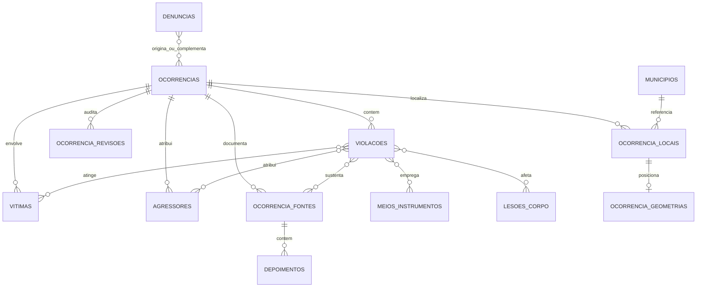

# Arquitetura de Dados Alvo — OVPDH

**Documento**: 06

**Data**: 24 de agosto de 2026
**Status**: Baseline lógica para validação de produto, curadoria e privacidade

## 1. Objetivo e evidências

Este documento define o modelo de dados de toda a aplicação antes do desenho detalhado da interface. A proposta foi elaborada a partir de quatro evidências:

1. requisitos funcionais registrados em `spec.md`;
2. estrutura e dados do backup PostgreSQL `pcvi_backup_260821`;
3. tabelas já criadas pela aplicação CodeIgniter;
4. migrations PostgreSQL/PostGIS já preparadas.

O backup é a principal evidência do domínio. Ele contém 3.685 ocorrências, 4.656 violações, 5.093 vítimas, 4.280 autores institucionais, 5.534 fontes, 1.397 depoimentos, 56 denúncias recebidas e 937 pontos geográficos. Esses volumes e suas relações demonstram que ocorrência, violação, vítima, autor e fonte são entidades distintas.

## 2. Três camadas de dados

| Camada | Papel | Regra |
| --- | --- | --- |
| Legado PostgreSQL | Fonte histórica e evidência do domínio. | Deve permanecer imutável e rastreável. |
| Modelo-alvo PostgreSQL/PostGIS | Estrutura canônica da nova aplicação. | Orienta novas migrations, serviços, filtros e telas. |
| Banco demonstrativo atual | Protótipo CodeIgniter ainda configurado localmente em MySQL, com 12 ocorrências. | Não deve ser usado como definição do domínio nem como fonte da migração histórica. |

O banco canônico de produção será PostgreSQL com PostGIS. A configuração MySQL local é transitória e deve ser substituída em atividade técnica própria, sem apagar os dados demonstrativos antes de decidir se serão preservados.

## 3. Princípios de modelagem

- **Preservação**: nenhum dado legado é descartado, sobrescrito ou publicado automaticamente.
- **Rastreabilidade**: cada registro importado mantém origem, identificador, lote e resultado da transformação.
- **Normalização útil**: valores usados em filtros e indicadores usam catálogos; texto original permanece disponível para conferência.
- **Privacidade por estrutura**: contato, nome sigiloso, endereço exato e depoimentos sensíveis ficam separados ou classificados como restritos.
- **Publicação explícita**: informação interna e informação pública usam campos e regras de acesso diferentes.
- **Temporalidade**: datas de negócio e auditoria usam tipos próprios; eventos usam `timestamp with time zone`, armazenado em UTC.
- **Geografia protegida**: a geometria PostGIS é a fonte espacial; a precisão e a visibilidade pública são atributos obrigatórios.
- **Exclusão lógica**: entidades de negócio e conteúdo não são apagadas fisicamente pela aplicação comum.
- **Vocabulário versionável**: catálogos podem ser inativados, mas IDs e valores históricos continuam válidos.

## 4. Contextos do modelo-alvo

### 4.1 Identidade e autorização

| Entidade | Responsabilidade | Relações centrais |
| --- | --- | --- |
| `users` e tabelas Shield | Conta, autenticação e estado da conta. | Autorias, revisões, atribuições e auditoria. |
| grupos e permissões Shield | Perfis e permissões efetivas. | Usuários N:N com grupos/permissões. |
| `autorizacoes_acesso_restrito` | Concessão acadêmica temporária por projeto e ocorrência. | Usuário, supervisor, escopo, justificativa, início, fim e revogação. |
| `eventos_auditoria` | Evento imutável de segurança ou mudança de dados. | Usuário, entidade, registro, ação, instante e metadados mínimos. |

Os perfis são política de autorização, não uma coluna livre na ocorrência. Desativar usuário não remove sua autoria histórica.

### 4.2 Entrada e triagem de denúncias

| Entidade | Campos centrais | Regra |
| --- | --- | --- |
| `denuncias` | protocolo, narrativa, data/local informado, canal, status de triagem, consentimentos e datas | Recebimento não equivale a ocorrência verificada. |
| `denuncia_contatos_restritos` | nome, contato e preferência de retorno | Acesso restrito e nunca publicado. |
| `denuncia_solicitacoes_apoio` | tipo de apoio e encaminhamento | Preserva as opções jurídica, psicológica e assistencial do legado. |
| `denuncia_ocorrencias` | denúncia, ocorrência e tipo de vínculo | Uma denúncia pode originar ou complementar uma ocorrência; a conversão não apaga a entrada. |

Status inicial proposto: `recebida`, `em_triagem`, `convertida`, `descartada` e `arquivada`. Motivo é obrigatório para descarte. O formulário público e a fila ativa de denúncias ficam fora do MVP; nesta fase, os 56 registros legados são preservados para consulta administrativa restrita.

### 4.3 Ocorrências e fluxo de curadoria

| Entidade | Campos centrais | Regra |
| --- | --- | --- |
| `ocorrencias` | título de trabalho, relato factual, resumo público, data inicial/final, precisão da data, período do dia, importância, status, autoria e datas | Unidade documental do fato; somente `publicado` aparece externamente. |
| `ocorrencia_locais` | município, bairro/localidade, endereço restrito, referência imprecisa e nível de precisão | Separa localização de trabalho da apresentação pública. |
| `ocorrencia_geometrias` | ponto 4326, precisão, fonte e visibilidade | No máximo uma geometria principal por local; coordenada exata pode ser restrita. |
| `ocorrencia_revisoes` | ação, estado anterior/novo, autor, comentário e instante | Histórico imutável de decisão editorial/curatorial. |
| `ocorrencia_atribuicoes` | ocorrência, usuário, papel, início e fim | Separa autor imutável, responsável atual único, colaboradores e revisor. |
| `ocorrencia_versoes` | ocorrência, número, versão-base, estado, autor e datas | Mantém edição concorrente, comparação e revisão sem sobrescrever versões anteriores. |
| `ocorrencia_publicacoes` | ocorrência, versão publicada, autor, instante e versão substituída | Mantém a projeção pública estável durante novas edições. |

Estados canônicos: `rascunho`, `em_revisao`, `aprovado`, `publicado`, `rejeitado` e `arquivado`. Valores legados são transformados somente após homologação do mapa de status.

Um rascunho pode ser quase vazio. Para revisão, exige data ou período, município, relato interno, ao menos uma violação, informação disponível sobre vítima/grupo, uma fonte e classificação de privacidade. Para publicar, exige versão aprovada, resumo público, localização pública, conferência dos documentos/dados identificáveis e prévia.

Ao editar ocorrência publicada, a versão pública anterior permanece ativa enquanto uma nova versão percorre o fluxo interno. Risco ou erro grave permite despublicação imediata com justificativa. Controle otimista impede sobrescrita silenciosa quando duas pessoas editam a mesma versão.

### 4.4 Violações e enquadramento

| Entidade | Responsabilidade |
| --- | --- |
| `violacoes` | Evento violador específico dentro de uma ocorrência. |
| `tipos_violacao` | Classificação do que ocorreu. |
| `condutas` | Contexto/forma da ação estatal. |
| `classes_juridicas` e `tipos_juridicos` | Enquadramentos legais, artigo e descrição. |
| `meios_instrumentos` | Meios empregados, como arma de fogo ou spray. |
| `lesoes_corpo` | Região corporal atingida; o nome deve ser revisto para não confundir lesão com parte do corpo. |
| `violacao_meios_instrumentos` | Relação N:N entre violação e meio. |
| `violacao_lesoes_corpo` | Relação N:N entre violação e região/lesão. |

Uma ocorrência possui uma ou várias violações. A classificação direta `ocorrencia_tipos_violencia` pode permanecer durante a transição, mas indicadores canônicos devem partir de `violacoes` para evitar dupla contagem.

### 4.5 Vítimas e grupos afetados

| Entidade | Campos centrais | Regra |
| --- | --- | --- |
| `vitimas` | tipo de entidade, idade/faixa, raça/cor, gênero, escolaridade, ocupação, nacionalidade, habitação e marcadores de condição | Pode representar indivíduo, coletividade ou outro tipo previsto no legado. |
| `vitima_dados_restritos` | nome e observações identificáveis | Sempre restrito; nomes nunca integram a projeção pública. |
| `condicoes_vitima` | condição ou grupo afetado | Catálogo administrável. |
| `vitima_condicoes` | vítima N:N condição | Evita campo textual único. |
| `vitima_violacoes` | vítima N:N violação | Preserva quais violações atingiram cada vítima. |

Valores desconhecidos, não coletados e não aplicáveis não são sinônimos. Os catálogos devem possuir códigos distintos quando essa distinção for relevante à pesquisa.

Orientação sexual, religião, deficiência e outros dados sensíveis só são coletados quando necessários e com acesso restrito. A futura interface deve explicar a finalidade desses campos e permitir `não informado`.

Na área pública podem aparecer apenas faixa etária, gênero, raça/cor e condição ampla relevantes, desde que a combinação não gere reidentificação. Idade exata, profissão e demais atributos sensíveis permanecem internos/restritos.

### 4.6 Autores institucionais e agentes envolvidos

| Entidade | Campos centrais | Regra |
| --- | --- | --- |
| `agressores` | classe/tipo institucional, órgão/unidade, cargo/função, identificado e observações | Nome técnico mantido por compatibilidade; a interface usa “Agentes e instituições envolvidos”. |
| `agressor_dados_restritos` | nome/identificação sustentada por fonte | Sempre restrito; nomes individuais nunca são públicos. |
| `instituicao_classes` | corporação ou classe ampla | Ex.: Polícia Militar, Polícia Civil, sistema penitenciário. |
| `instituicao_tipos` | unidade ou agrupamento subordinado à classe | Ex.: BOPE, ROTA, CORE. |
| `agressor_violacoes` | agressor N:N violação | Preserva a atribuição específica registrada no legado. |

O vínculo expressa atribuição documentada pelas fontes, não condenação. A interface e os textos públicos devem deixar essa distinção clara.

Instituição, corporação, unidade e patente/cargo podem ser públicos após curadoria. Quando a combinação com local e data identificar inequivocamente uma pessoa, a apresentação é generalizada.

### 4.7 Fontes, depoimentos e arquivos

| Entidade | Campos centrais | Regra |
| --- | --- | --- |
| `ocorrencia_fontes` | tipo, título, data, referência/URL, acesso audiovisual, denúncia, restrição e observações | Cada fonte pertence a uma ocorrência. |
| `fonte_violacoes` | fonte N:N violação | Indica qual alegação a fonte sustenta. |
| `depoimentos` | fonte, tipo de depoente, nome restrito, texto, observações e visibilidade | Depoimento é conteúdo potencialmente sensível. |
| `arquivos` | nome lógico, caminho/chave, MIME, tamanho, checksum, classe de acesso e autoria | Metadado único para anexos e publicações. |
| `fonte_arquivos` | fonte N:N arquivo e finalidade | Suporta imagem, áudio, vídeo e documento sem misturar binário ao banco. |
| `arquivo_derivacoes` | arquivo original, derivado, finalidade, autor e aprovação | Vincula original restrito à cópia pública efetivamente expurgada. |

URL, referência bibliográfica e arquivo local são formas distintas de acesso à fonte. Um registro não deve exigir URL quando a fonte for entrevista, processo ou documento físico.

Tarjas públicas devem remover o conteúdo da cópia derivada; sobrepor um retângulo sem eliminar texto, metadados ou camadas não é anonimização. A publicação de arquivo também exige confirmação de direitos de divulgação.

### 4.8 Geografia e catálogos territoriais

| Entidade | Responsabilidade |
| --- | --- |
| `ufs` | Unidades federativas, incluindo valor histórico que demande revisão. |
| `municipios` | Município vinculado à UF e, futuramente, código IBGE homologado. |
| `ocorrencia_locais` | Endereço, bairro/localidade e referência de precisão. |
| `ocorrencia_geometrias` | Geometria PostGIS e política de exibição. |

UF é derivada do município; não deve ser digitada duas vezes. Município e UF podem ser públicos; bairro/comunidade depende de curadoria; endereço e coordenada exatos nunca são públicos. Mapas externos usam ponto deslocado, área aproximada ou centroide territorial.

### 4.9 Conteúdo público

| Entidade | Responsabilidade |
| --- | --- |
| `historico` | Itens do acervo histórico, estado editorial e metadados. |
| `produtos` | Produções acadêmicas, publicação e identificadores como DOI. |
| `colecoes` | Recortes editoriais temáticos, territoriais ou históricos. |
| `colecao_ocorrencias` | Ordena ocorrências numa coleção sem alterar seu estado de publicação. |
| `arquivos` | Arquivos e miniaturas com checksum, direitos e acessibilidade. |
| `eventos_auditoria` | Alterações editoriais e substituições de arquivo. |

As tabelas existentes são preservadas. Coleções só apresentam a versão pública vigente de cada ocorrência; despublicar o caso o remove da projeção da coleção sem apagar o vínculo editorial. Normalização de autores, categorias e palavras-chave só será criada quando filtros ou integração externa justificarem o custo.

### 4.10 Migração e qualidade

| Entidade | Responsabilidade |
| --- | --- |
| `migracao_lotes` | Identifica execução, origem, checksum, versão do transformador, modo e resultado. |
| `registros_origem_legado` | Mapeia tabela/ID de origem para tabela/ID de destino e guarda checksum/resultado. |
| `catalogo_legado_mapeamentos` | Correspondência homologada entre valores antigos e catálogos canônicos. |
| `pendencias_qualificacao` | Fila de dado ausente, ambíguo, conflitante ou não mapeado. |

`ocorrencia_origens_legado`, já criada na migration projetada, cobre apenas ocorrências. Antes da importação definitiva, a rastreabilidade deve alcançar também violações, vítimas, autores, fontes, depoimentos e relações N:N.

Curadores podem sugerir valores de catálogo pelo próprio formulário. A sugestão preserva o texto digitado e entra em pendência; somente administradores homologam, fundem, renomeiam ou inativam itens. Nenhuma operação reaproveita IDs com outro significado.

### 4.11 Participação acadêmica futura

`programas_academicos`, `participacoes_academicas`, `contribuicoes_academicas`, `pontuacoes_academicas` e `conquistas_academicas` permanecem fora do MVP. Se aprovadas, usam apenas contribuições validadas e não recebem cópias de dados pessoais.

## 5. Cardinalidades que a aplicação deve preservar

## 6. Regras físicas para PostgreSQL

- IDs novos usam `bigint generated by default as identity`; IDs legados ficam em colunas de origem, não controlam a sequência canônica.
- Datas de evento usam `date`; período aproximado usa data inicial/final e código de precisão.
- Auditoria usa `timestamp with time zone`; a apresentação converte para o fuso do usuário.
- Flags usam `boolean`, não `tinyint`.
- Catálogos têm `codigo`, `nome`, `ativo`, datas e unicidade de código.
- Relações N:N têm chave única composta e chaves estrangeiras indexadas.
- Exclusão física em cascata não é usada para ocorrências e dados documentais; a regra padrão é `RESTRICT` e exclusão lógica.
- Rascunho nunca submetido admite exclusão lógica; após submissão, ocorrência e itens associados somente são rejeitados, arquivados, desassociados ou versionados pela interface.
- Entidades editáveis usam versão para bloqueio otimista; atualização baseada em versão antiga falha com conflito explícito.
- Geometria usa `geometry(Point, 4326)` com índice GIST e validação de latitude/longitude.
- Pesquisa textual pode usar `tsvector` e índice GIN em etapa posterior, após definir quais campos são pesquisáveis por perfil.
- Dados restritos não são incluídos em views públicas, exportações gerais ou logs de aplicação.
- Visualização e download de dado restrito geram auditoria com usuário, instante, registro e modalidade, sem copiar o conteúdo consultado.

## 7. Implicações para a interface

A interface deve refletir os agregados do modelo, sem expor sua complexidade de uma vez. A ficha interna validada possui sete seções:

1. **Identificação do fato**: título de trabalho, data/período, local, relato interno e relevância.
2. **Violações**: cartões repetíveis com tipo, conduta, enquadramento, meios e lesões.
3. **Pessoas/grupos afetados**: vítimas e condições, com aviso de sensibilidade e vínculo às violações.
4. **Agentes/instituições**: classe, unidade, cargo e vínculo às violações.
5. **Fontes/evidências**: fontes, arquivos e depoimentos, vinculáveis às violações.
6. **Privacidade e versão pública**: resumo público, localização generalizada, anonimização, derivados expurgados e prévia.
7. **Curadoria**: completude, responsável, colaboradores, histórico, comparação e transição de estado.

O rascunho pode ser parcial e a navegação não é linear. Cada seção mostra completude. Com uma única violação, vínculos podem ser automáticos; com várias, vítimas, agentes e fontes devem indicar a quais se relacionam. Itens sem vínculo geram alerta e permanecem permitidos apenas em rascunho.

As listas usam busca por digitação, sugestões recentes e agrupamento. A opção `outro` abre sugestão de catálogo sem bloquear o registro.

## 8. Decisões homologadas em 24 de agosto de 2026

- nomes individuais nunca são públicos, inclusive de vítimas, agentes, denunciantes, depoentes e testemunhas;
- curadores consultam dados completos com auditoria; participantes acadêmicos recebem acesso restrito somente por projeto e ocorrência;
- instituição, unidade e cargo/patente podem ser públicos, com generalização contra identificação indireta;
- município e UF podem ser públicos, bairro depende de curadoria e endereço/coordenada exatos são restritos;
- apenas categorias demográficas amplas e não identificáveis podem integrar a versão pública;
- relato interno e resumo público são independentes; documentos usam original restrito e derivado realmente expurgado;
- rascunho, revisão e publicação possuem níveis progressivos de obrigatoriedade;
- autoria, responsabilidade, colaboração e revisão são papéis distintos;
- concorrência não sobrescreve alterações; conteúdo publicado é substituído somente por nova versão aprovada;
- curadores sugerem valores e administradores governam os catálogos;
- após a primeira submissão, dados documentais não são apagados pela interface;
- denúncias legadas serão preservadas para consulta restrita, sem fila ativa no MVP.

## 9. Decisões ainda pendentes

1. Mapa final dos seis status legados para os estados canônicos.
2. Revisão institucional da finalidade de cada atributo demográfico sensível.
3. Vocabulário de `lesoes_corpo`, distinguindo região atingida de natureza da lesão.
4. Regras para considerar uma fonte suficiente para revisão e para publicação.
5. Parâmetros técnicos de generalização dos pontos no mapa público.
6. Responsáveis e prazos da política de retenção e atendimento a direitos dos titulares.

## 10. Ordem recomendada de implementação

1. Homologar este modelo e as decisões de privacidade.
2. Produzir o dicionário físico campo a campo e o mapa origem → destino.
3. Criar migrations aditivas que completem o modelo-alvo.
4. Implementar importador idempotente com `--dry-run` e relatórios.
5. Validar contagens, relações, amostras e indicadores.
6. Desenhar protótipo da interface a partir das sete seções validadas do formulário.
7. Implementar primeiro ocorrência, violação, pessoas, agentes e fontes; depois triagem, mapas e conteúdo editorial.
