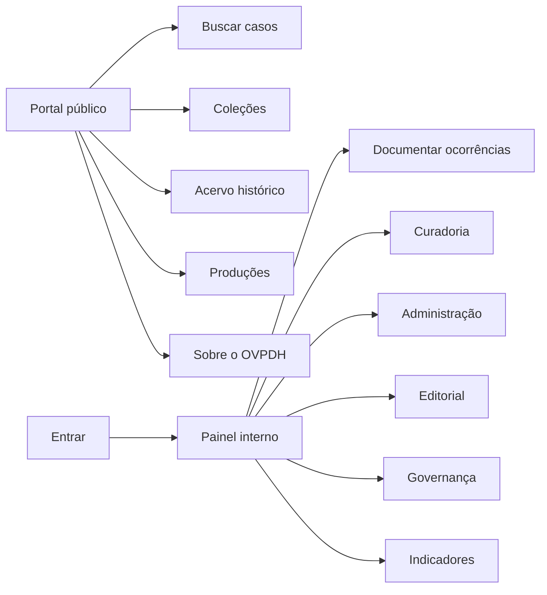
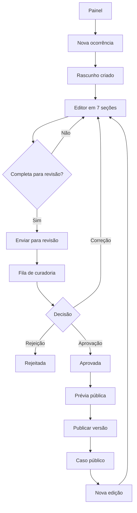

# Mapa de navegação por perfil — Etapa 1

**Versão:** 0.1.0  
**Data:** 25 de agosto de 2026  
**Tarefa:** T007  
**Dependência:** `../contracts/routes.md`

## 1. Modelo de navegação

O sistema possui três contextos visuais:

1. **Portal público:** conteúdo aprovado e publicado, sem autenticação.
2. **Painel interno:** trabalho documental, curadoria, administração e governança, sempre autenticado.
3. **Autenticação:** entrada, recuperação de acesso e mensagens de segurança.

O painel usa um único layout CodeIgniter. A navegação muda por permissão e por escopo do registro; não haverá “aplicações” separadas para cada perfil.

## 2. Navegação pública

| Item principal | Destino | Conteúdo |
| --- | --- | --- |
| Início | `/` | Apresentação, destaques e atalhos. |
| Casos | `/ocorrencias` | Busca e filtros de versões publicadas. |
| Coleções | `/colecoes` | Recortes editoriais temáticos, históricos ou territoriais. |
| Acervo histórico | `/historico` | Documentos e dossiês publicados. |
| Produções acadêmicas | `/produtos` | Artigos, livros, relatórios, teses e outros produtos. |
| Sobre | `/sobre` | Missão, equipe, parceiros e contato institucional. |
| Área da equipe | rota Shield de login | Entrada no ambiente privado. |

O portal não mostra links para rascunhos, dados restritos, auditoria ou operações administrativas.

## 3. Navegação interna comum

Todos os usuários autenticados recebem:

- cabeçalho com identidade do sistema, contexto atual, conta e saída;
- menu lateral ou recolhível com itens autorizados;
- breadcrumb;
- título e descrição curta da página;
- mensagens de sucesso, alerta e validação;
- indicação clara quando um dado ou documento é restrito.

### Usuário comum, voluntário ou aluno

| Ordem | Item | Destino |
| --- | --- | --- |
| 1 | Visão geral | `/painel` |
| 2 | Nova ocorrência | criação de rascunho |
| 3 | Minhas ocorrências | `/painel/ocorrencias?escopo=minhas` |
| 4 | Ocorrências atribuídas | `/painel/ocorrencias?escopo=atribuidas` |
| 5 | Consulta interna | `/painel/ocorrencias?escopo=consulta` conforme permissão |
| 6 | Minha conta | rota de conta do Shield |

Esse perfil não vê fila de curadoria, publicação, usuários, auditoria ou homologação de catálogos. Sugestões de catálogo aparecem contextualizadas dentro da ficha.

### Curador

Recebe os itens do usuário comum e, adicionalmente:

| Ordem | Item | Destino |
| --- | --- | --- |
| 1 | Fila de curadoria | `/painel/curadoria` |
| 2 | Casos sob responsabilidade | `/painel/ocorrencias?escopo=responsabilidade` |
| 3 | Pendências de revisão | filtro da fila |
| 4 | Indicadores autorizados | `/painel/relatorios/indicadores` |

O curador não recebe ação de curadoria em registro próprio. A interface explica o impedimento sem ocultar o histórico.

### Administrador

Recebe recursos de documentação e curadoria e, adicionalmente:

| Grupo | Itens |
| --- | --- |
| Administração | Usuários; catálogos e glossários; autorizações acadêmicas. |
| Governança | Auditoria; pendências de qualificação. |
| Editorial | Coleções; acervo histórico; produções acadêmicas. |
| Relatórios | Indicadores internos e exportações autorizadas. |

### Superadministrador

Recebe apenas administração do site e configurações explicitamente concedidas. Não herda automaticamente dados de ocorrências, curadoria, usuários ou conteúdo restrito.

## 4. Percurso da ocorrência

## 5. Navegação dentro da ficha

As sete seções permanecem visíveis como uma sequência, com estado `não iniciada`, `em preenchimento`, `completa` ou `com pendência`:

1. Identificação do fato.
2. Violações.
3. Vítimas e grupos.
4. Agentes e instituições.
5. Fontes e evidências.
6. Privacidade e versão pública.
7. Curadoria e histórico.

Regras:

- salvar uma seção não exige completar as demais;
- “Salvar e continuar” avança para a próxima seção;
- “Salvar rascunho” mantém o contexto;
- “Enviar para revisão” só aparece quando a completude mínima for satisfeita;
- alertas de conflito, restrição e pendência aparecem junto ao campo afetado;
- o histórico é consultável, mas nunca editável.

## 6. Objetos e ações globais

| Objeto | Ações visíveis conforme autorização |
| --- | --- |
| Ocorrência | abrir, editar, atribuir, enviar, revisar, publicar, despublicar, arquivar. |
| Usuário | criar, editar, desativar, consultar autoria preservada. |
| Catálogo | consultar, sugerir, homologar, fundir, renomear, inativar. |
| Coleção | criar, ordenar, ativar, desativar, consultar versão pública. |
| Autorização | conceder, consultar, revogar e verificar expiração. |
| Auditoria | filtrar e consultar metadados; nunca editar ou apagar. |

## 7. Estados e retornos

- **Sem conteúdo:** explica por que a lista está vazia e oferece apenas uma ação pertinente.
- **Sem permissão:** não revela conteúdo do registro e orienta retorno seguro.
- **Validação:** mantém valores informados, leva o foco ao resumo e associa erro ao campo.
- **Conflito de edição:** preserva a contribuição, mostra que existe versão mais recente e oferece comparação.
- **Sessão expirada:** retorna ao login e, quando seguro, preserva o destino originalmente solicitado.
- **Ação concluída:** confirma objeto e novo estado, evitando mensagens genéricas.

## 8. Critérios de aceite de T007

- Cada perfil possui entrada, itens principais e limites explícitos.
- Todo item de navegação corresponde a uma rota do contrato T006.
- O percurso rascunho → publicação é contínuo e possui retornos de correção.
- A ficha mantém as sete seções aprovadas.
- A ausência de um item no menu não é tratada como mecanismo de segurança.

