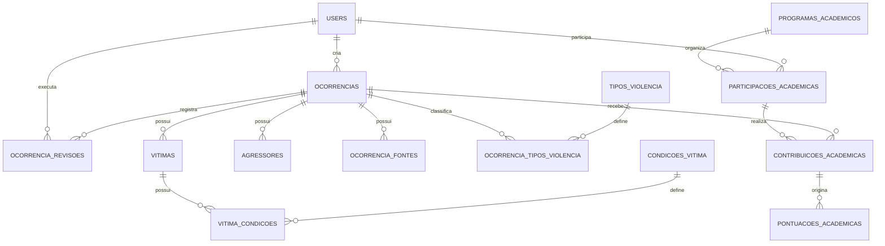

# MER Projetado — OVPDH

**Documento**: 02  
**Data**: 23 de agosto de 2026  
**Status**: Proposta para validação antes da implementação

## Convenções

- **Existente**: tabela já presente na aplicação e que será preservada.
- **Evolução imediata**: nova tabela ou campo aditivo, criado por migration sem apagar dados legados.
- **Fase futura**: estrutura reservada para gamificação acadêmica; não integra a primeira entrega.

## Entidades e relacionamentos

## Entidades existentes

| Entidade | Chave | Responsabilidade |
| --- | --- | --- |
| `users` | `id` | Usuários autenticados pelo CodeIgniter Shield. |
| `ocorrencias` | `id` | Fato documentado, status, localização, relato, fontes legadas e autoria. |
| `vitimas` | `id`, `ocorrencia_id` | Pessoas ou grupos afetados pela ocorrência. |
| `agressores` | `id`, `ocorrencia_id` | Agentes estatais ou instituições vinculados ao fato. |
| `ocorrencia_revisoes` | `id`, `ocorrencia_id`, `user_id` | Histórico imutável de curadoria e mudanças de status. |
| `historico` | `id` | Dossiês e documentos do acervo histórico. |
| `produtos` | `id` | Produções acadêmicas divulgadas pelo Observatório. |

## Evolução imediata

| Entidade | Chaves e campos centrais | Regra |
| --- | --- | --- |
| `tipos_violencia` | `id`, `nome`, `ativo` | Catálogo de classificações aprovadas. |
| `ocorrencia_tipos_violencia` | `ocorrencia_id`, `tipo_violencia_id` | Relação N:N: uma ocorrência pode receber várias classificações. |
| `ocorrencia_fontes` | `id`, `ocorrencia_id`, `tipo`, `referencia`, `url`, `descricao`, `data_acesso` | Estrutura fontes sem apagar o campo legado `ocorrencias.fontes`. |
| `condicoes_vitima` | `id`, `nome`, `ativo` | Catálogo de condições ou grupos afetados. |
| `vitima_condicoes` | `vitima_id`, `condicao_vitima_id` | Relação N:N: uma vítima pode ter múltiplas condições. |

## Fase futura — participação acadêmica

| Entidade | Finalidade |
| --- | --- |
| `programas_academicos` | Identifica disciplina, curso, projeto ou programa participante. |
| `participacoes_academicas` | Vincula um usuário a um programa e período de participação. |
| `contribuicoes_academicas` | Registra contribuição validada pela curadoria e ligada a uma ocorrência. |
| `pontuacoes_academicas` | Mantém a pontuação auditável e condicionada à aprovação. |
| `conquistas_academicas` | Catálogo de distintivos pedagógicos baseados em qualidade. |

## Compatibilidade com o legado

- As tabelas existentes e seus IDs não serão recriados nem removidos.
- As novas estruturas serão criadas somente por migrations incrementais.
- Valores antigos fora dos catálogos serão preservados como `legado não classificado` até revisão humana.
- A exclusão de ocorrência é lógica, por `deleted_at`; vítimas, agressores e revisões não devem ser apagados fisicamente.
- O status legado `arquivado` permanece válido e o novo status `rejeitado` será apenas adicionado ao conjunto aceito.
