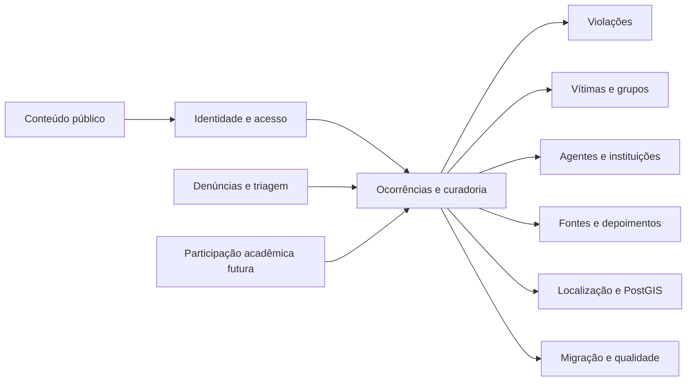
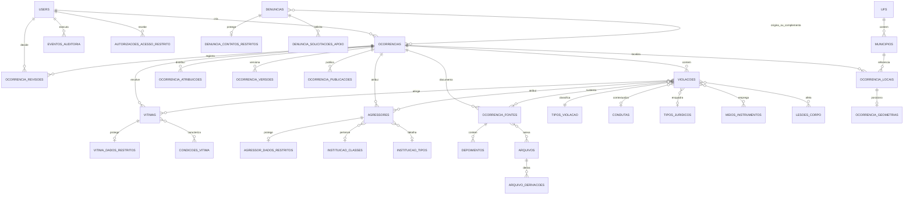

# MER Projetado — OVPDH

**Documento**: 02

**Atualizado em**: 24 de agosto de 2026
**Status**: Modelo lógico completo; implementação física incremental

## Convenções

- **Canônico**: estrutura de referência para novos fluxos, filtros e indicadores.
- **Compatibilidade**: tabela ou campo já existente que permanece durante a transição.
- **Restrito**: dado pessoal ou operacional que não pode integrar consultas públicas.
- **Futuro**: estrutura fora do MVP.

O detalhamento, as regras físicas e as implicações para a interface estão em `arquitetura-dados.md`.

## Visão dos contextos

## Núcleo relacional

## Entidades por prioridade

### P0 — preservação e migração

| Entidade | Situação | Observação |
| --- | --- | --- |
| `migracao_lotes` | A criar | Identifica e torna reversível cada execução. |
| `registros_origem_legado` | A criar | Rastreia toda entidade e relação importada. |
| `catalogo_legado_mapeamentos` | Criada na migration projetada | Mapeamentos dependem de homologação humana. |
| `pendencias_qualificacao` | A criar | Mantém ausências, conflitos e valores não mapeados. |

### P1 — cadastro e curadoria de ocorrências

| Entidade | Situação | Evolução necessária |
| --- | --- | --- |
| `ocorrencias` | Existente | Separar relato interno/resumo público; normalizar data, período e local. |
| `violacoes` | Criada na migration projetada | Substituir conduta e enquadramento textuais por FKs; preservar texto legado. |
| `vitimas` | Existente | Normalizar demografia, tipo de entidade e dados restritos. |
| `agressores` | Existente | Normalizar classe/tipo institucional e identificação restrita. |
| `ocorrencia_fontes` | Criada na migration projetada | Acrescentar tipo de fonte, audiovisual e relações com violações. |
| `depoimentos` | A criar | Preservar 1.397 registros legados com acesso restrito. |
| `ocorrencia_revisoes` | Existente | Manter imutável e completar FKs/índices. |
| `ocorrencia_atribuicoes` | A criar | Suportar fila de trabalho e responsáveis. |
| `ocorrencia_versoes` e `ocorrencia_publicacoes` | A criar | Evitar sobrescrita concorrente e manter versão pública estável durante correções. |
| `autorizacoes_acesso_restrito` | A criar | Conceder acesso acadêmico temporário, supervisionado e auditável. |

### P1 — relações que faltam na migration atual

| Relação | Evidência no legado | Finalidade |
| --- | ---: | --- |
| `vitima_violacoes` | 5.493 linhas | Quais violações atingiram cada vítima. |
| `agressor_violacoes` | 5.070 linhas | Quais violações são atribuídas a cada agente/instituição. |
| `fonte_violacoes` | 3.651 linhas | Qual fonte sustenta cada violação. |
| `violacao_meios_instrumentos` | 4.795 linhas | Meios empregados. |
| `violacao_lesoes_corpo` | 1.308 linhas | Regiões/lesões associadas. |

### P2 — entrada, espaço e publicação

| Entidade | Situação | Observação |
| --- | --- | --- |
| `denuncias` e dados associados | A criar | Não confundir relato recebido com fato curado. |
| `ufs` e `municipios` | A criar no alvo | O legado possui 28 UFs e 5.571 municípios. |
| `ocorrencia_locais` | A criar | Separa endereço restrito e referência pública. |
| `ocorrencia_geometrias` | Criada na migration projetada | Deve referenciar o local e incluir regra de visibilidade. |
| `arquivos` | A criar | Metadados, checksum, acesso e reutilização por fontes/conteúdos. |
| `arquivo_derivacoes` | A criar | Vincula original restrito a versão pública efetivamente expurgada. |
| `historico` e `produtos` | Existentes | Preservar; evoluir estado editorial e auditoria. |
| `colecoes` e `colecao_ocorrencias` | A criar | Agrupar versões públicas por tema, território ou período sem duplicar ocorrências. |

### Futuro — participação acadêmica

`programas_academicos`, `participacoes_academicas`, `contribuicoes_academicas`, `pontuacoes_academicas` e `conquistas_academicas` permanecem apenas como ganchos de arquitetura.

## Catálogos canônicos necessários

- território: UF, município e precisão geográfica;
- ocorrência: período do dia, precisão temporal e status;
- violação: tipo, conduta, classe/tipo jurídico, meio/instrumento e região/lesão;
- vítima: tipo de entidade, raça/cor, gênero, escolaridade, ocupação, nacionalidade, habitação, orientação sexual, religião/credo e condições;
- agentes: classe e tipo institucional;
- fontes: tipo de fonte, tipo audiovisual e tipo de depoente;
- governança: classe de acesso, motivo de pendência e resultado de migração.

Cada catálogo usa código estável, nome apresentado, descrição, estado ativo e datas. “Não informado”, “não coletado”, “não se aplica” e “dado ausente no legado” devem permanecer semanticamente distintos.

## Compatibilidade e transição

- Tabelas e IDs atuais não são removidos.
- Campos textuais existentes permanecem como evidência até a homologação e a conferência da migração.
- A migration `CreateProjectedOvpdhTables` é um primeiro incremento, não a conclusão do modelo.
- Novas mudanças são feitas em migrations posteriores; migrations já aplicadas não são reescritas.
- O legado `public` é a origem candidata. O esquema `old` é referência comparativa e não pode ser importado junto sem deduplicação homologada.
- O status `Aprovado` legado não se transforma em `publicado` automaticamente.
- Dados identificáveis e geometrias exatas começam restritos, inclusive quando o status da ocorrência for público.
