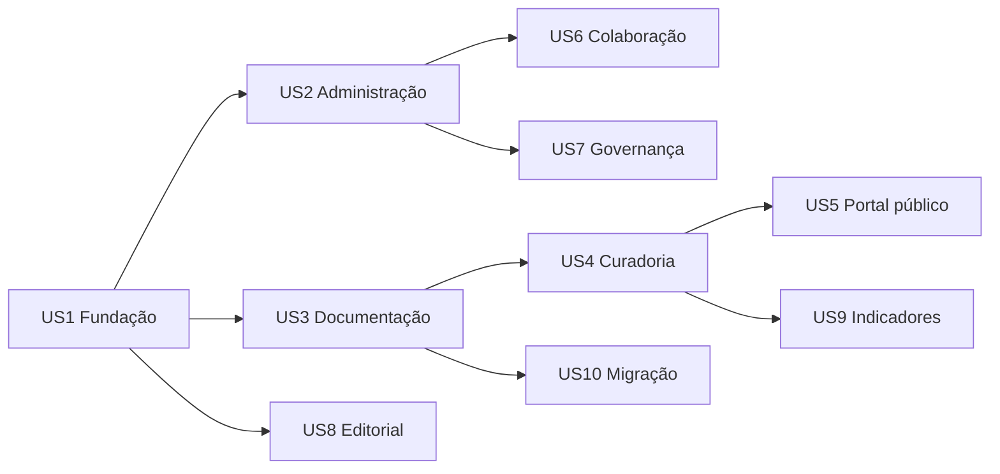

# Plano de Implementação: Etapa 1 do OVPDH

**Branch**: `001-core-doc`

**Versão do documento**: 0.1.0

**Data**: 24 de agosto de 2026

**Spec**: `spec.md`

**Modelo de dados**: `arquitetura-dados.md` e `mer-projetado.md`

**Status**: Baseline para revisão antes da implementação

## 1. Resultado da etapa

A Etapa 1 entrega um percurso vertical demonstrável:

1. administrador cria usuário, vínculo institucional e permissões;
2. administrador mantém catálogos e homologa sugestões;
3. usuário comum, voluntário ou aluno cria e complementa uma ocorrência;
4. responsável e colaboradores trabalham nas sete seções da ficha;
5. curador revisa, solicita correção, aprova e prepara a versão pública;
6. curador publica uma versão sem dados restritos;
7. visitante pesquisa e consulta a ocorrência publicada.

O objetivo não é importar todo o legado nesta etapa. O esquema, as telas e os serviços devem, porém, estar preparados para receber a importação idempotente posterior.

## 2. Escopo funcional

### Incluído

- layouts CodeIgniter para autenticação, portal público e painel interno;
- navegação interna condicionada por permissões;
- gestão administrativa de usuários, vínculos, grupos e permissões;
- glossários, catálogos, sugestões e homologação;
- painel de trabalho, minhas ocorrências e ocorrências atribuídas;
- ficha de ocorrência em sete seções;
- violações, vítimas/grupos, agentes/instituições e fontes vinculáveis;
- atribuição de responsável e colaboradores;
- controle otimista de concorrência e histórico de versões;
- fila de curadoria e transições de estado;
- resumo, localização e prévia pública;
- publicação versionada e despublicação emergencial;
- consulta pública de ocorrências publicadas;
- auditoria de ações e acessos restritos;
- testes de domínio, autorização, persistência e fluxos críticos.

### Preparado, mas não entregue integralmente

- importação completa das 3.685 ocorrências e relações do legado;
- formulário público e fila ativa de denúncias;
- indicadores analíticos avançados;
- mapa público interativo;
- gamificação ou pontuação acadêmica;
- integrações externas e APIs públicas;
- automação completa de expurgo de PDFs, imagens, áudio ou vídeo.

## 3. Contexto técnico

**Linguagem**: PHP 8.2+

**Framework**: CodeIgniter 4.7+

**Autenticação/autorização**: CodeIgniter Shield 1.3+

**Banco canônico**: PostgreSQL com PostGIS

**Interface**: Views e layouts nativos do CodeIgniter, Bootstrap e ativos locais em `public/assets/`

**Testes**: PHPUnit 10, testes de unidade, banco e integração HTTP do CodeIgniter

**Plataforma**: VPS Linux; desenvolvimento local Windows/XAMPP

**Escala inicial conhecida**: 3.685 ocorrências, 4.656 violações, 5.093 vítimas, 5.534 fontes, 937 geometrias e crescimento editorial contínuo

**Restrições**:

- nenhuma dependência de interface carregada por CDN;
- nenhuma consulta ao banco em Views;
- nenhuma regra de negócio relevante em Controllers;
- nomes individuais e localização exata nunca entram na projeção pública;
- migrations executadas não são reescritas;
- dados documentais submetidos não sofrem exclusão física pela interface.

## 4. Verificação da constituição

| Princípio | Atendimento nesta etapa |
| --- | --- |
| Stack definida | PHP, CodeIgniter, Shield, PostgreSQL/PostGIS e Bootstrap local. A constituição foi atualizada para 1.1.0. |
| MVC rigoroso | Controllers coordenam; Services aplicam casos de uso; Models persistem; Views apenas apresentam. |
| Código seguro | Autorização por rota e objeto, dados restritos separados e auditoria de acesso. |
| Banco evolutivo | Somente migrations incrementais e seeders versionados. |
| Ativos separados | CSS/JS em `public/assets/`; sem estilos, scripts ou eventos inline. |
| Entrega testável | Cada história possui teste independente e checkpoint antes da integração. |

Não há exceção constitucional prevista.

## 5. Arquitetura dos módulos

O sistema permanece um monólito modular CodeIgniter. “Módulo” é uma área funcional e de autorização, não uma aplicação separada.

| Código | Módulo | Namespace/pastas principais |
| --- | --- | --- |
| MOD-AUTH | Autenticação e conta | Shield, `app/Views/auth/`, `app/Views/layouts/auth.php` |
| MOD-WORK | Área de documentação | `app/Controllers/Painel/`, `app/Services/Ocorrencias/`, `app/Views/painel/` |
| MOD-CUR | Curadoria e publicação | `app/Controllers/Curadoria/`, `app/Services/Curadoria/`, `app/Views/curadoria/` |
| MOD-ADM | Administração | `app/Controllers/Admin/`, `app/Services/Admin/`, `app/Views/admin/` |
| MOD-EDT | Gestão editorial | `app/Controllers/Editorial/`, `app/Views/editorial/` |
| MOD-GOV | Qualidade e governança | `app/Controllers/Governanca/`, `app/Services/Governanca/`, `app/Views/governanca/` |
| MOD-REP | Indicadores e relatórios | `app/Controllers/Relatorios/`, `app/Services/Relatorios/`, `app/Views/relatorios/` |
| MOD-PUB | Portal público | `app/Controllers/Public/`, `app/Services/Publicacao/`, `app/Views/public/` |
| MOD-MIG | Migração e operação | `app/Commands/`, `app/Services/Migracao/` |

Controllers existentes em `app/Controllers/Admin/` serão migrados incrementalmente. Não haverá renomeação em massa antes de cada fluxo possuir teste de regressão.

## 6. Estrutura de projeto alvo

```text
app/
├── Commands/
├── Config/
├── Controllers/
│   ├── Admin/
│   ├── Curadoria/
│   ├── Editorial/
│   ├── Governanca/
│   ├── Painel/
│   ├── Public/
│   └── Relatorios/
├── Database/
│   ├── Migrations/
│   └── Seeds/
├── Entities/
├── Models/
├── Services/
│   ├── Admin/
│   ├── Curadoria/
│   ├── Governanca/
│   ├── Migracao/
│   ├── Ocorrencias/
│   └── Publicacao/
├── Validation/
└── Views/
    ├── admin/
    ├── auth/
    ├── components/
    ├── curadoria/
    ├── editorial/
    ├── governanca/
    ├── layouts/
    ├── painel/
    ├── public/
    └── relatorios/

public/assets/
├── css/
├── fonts/
├── images/
└── js/

tests/
├── database/
├── feature/
├── integration/
├── security/
└── unit/
```

## 7. Sistema de templates

### Layouts

| Layout | Uso |
| --- | --- |
| `app/Views/layouts/auth.php` | Login, recuperação e mensagens de autenticação. |
| `app/Views/layouts/internal.php` | Shell único para documentação, curadoria, administração e relatórios. |
| `app/Views/layouts/public.php` | Portal, coleções, ocorrências e conteúdo público. |

O layout `app/Views/layouts/admin.php` existente será mantido durante a transição e substituído gradualmente por `internal.php`.

### Componentes iniciais

- navegação e breadcrumb;
- mensagens de validação e feedback;
- indicador de status e completude;
- campo de catálogo com busca e sugestão;
- cartão repetível de violação, vítima, agente e fonte;
- alerta e marcador de dado restrito;
- histórico e comparação de versões;
- prévia pública;
- paginação, filtros e estado vazio.

Componentes são partials do CodeIgniter e recebem dados preparados pelo Controller/Service. JavaScript apenas melhora a interação; fluxos críticos continuam utilizáveis e validados no servidor.

## 8. Rotas funcionais propostas

| Prefixo | Módulo | Proteção |
| --- | --- | --- |
| `/` | Portal público | Sem autenticação; apenas projeções publicadas. |
| `/entrar`, rotas Shield | Autenticação | Regras do Shield. |
| `/painel` | Área de documentação | Sessão + autorização por autoria/atribuição. |
| `/painel/curadoria` | Curadoria | Permissões de revisão/publicação. |
| `/painel/admin` | Administração | Permissões administrativas específicas. |
| `/painel/editorial` | Gestão editorial | Permissões editoriais. |
| `/painel/governanca` | Qualidade/auditoria | Permissões de governança. |
| `/painel/relatorios` | Indicadores internos | Permissão de relatório e regras de agregação. |

As permissões são verificadas na rota e novamente no caso de uso para o registro concreto. Ocultar um link no menu não substitui autorização.

## 9. Histórias de entrega

| História | Prioridade | Entrega independente |
| --- | --- | --- |
| US1 — Fundação segura e templates | P0 | Usuário autentica e recebe layout/navegação corretos sem acessar área proibida. |
| US2 — Administração de usuários e catálogos | P1 | Administrador cria conta/vínculo e homologa sugestão de catálogo. |
| US3 — Documentação de ocorrência | P1 | Usuário cria rascunho, completa as sete seções e envia para revisão. |
| US4 — Curadoria e publicação versionada | P1 | Curador revisa registro alheio e publica prévia segura. |
| US5 — Consulta pública | P1 | Visitante pesquisa e abre apenas a versão pública autorizada. |
| US6 — Colaboração e acesso acadêmico | P2 | Responsável adiciona colaborador e concede acesso temporário auditado. |
| US7 — Governança e qualidade | P2 | Administrador consulta auditoria e resolve pendência de catálogo. |
| US8 — Conteúdo editorial | P2 | Editor administra acervo, produtos e coleções públicas. |
| US9 — Indicadores iniciais | P3 | Usuário autorizado consulta agregados sem dados identificáveis. |
| US10 — Migração do legado | P3 | Operador simula lote e reconcilia entidades/relações sem alterar a origem. |

## 10. Dependências e paralelização



Após US1, administração e núcleo de dados/documentação podem avançar em paralelo. O portal público pode ter layout e conteúdo institucional desenvolvidos em paralelo, mas a página de ocorrência depende da projeção segura de US4.

## 11. Portões de qualidade

Uma história só é concluída quando:

1. critérios de aceite e permissões possuem testes;
2. migration aplicável foi testada em PostgreSQL limpo e em base de homologação;
3. Views não contêm consulta, regra de autorização, CSS ou JavaScript inline;
4. acessibilidade básica foi verificada por teclado, foco, rótulos e mensagens;
5. dado restrito não aparece em HTML, JSON, log, exportação ou mensagem de erro não autorizada;
6. `composer test` passa;
7. documentação e `tasks.md` refletem o estado real.

## 12. Decisões bloqueadoras antes do código de domínio

- homologar o mapa de status legado para a importação; não bloqueia os status canônicos novos;
- concluir o dicionário físico dos campos canônicos;
- definir vocabulário de região corporal versus natureza da lesão;
- definir suficiência de fonte para aprovação e publicação;
- disponibilizar banco PostgreSQL de teste isolado e credenciais locais sem versioná-las.

Wireframes de baixa fidelidade e templates-base podem avançar enquanto essas decisões são concluídas.

## 13. Versionamento deste plano

O documento usa versão semântica:

- **MAJOR**: mudança de escopo ou arquitetura que invalida tarefas;
- **MINOR**: inclusão de módulo, história ou conjunto relevante de tarefas;
- **PATCH**: esclarecimento sem mudança de dependências.

### Histórico

- **0.1.0 — 2026-08-24**: baseline da Etapa 1, módulos, arquitetura CodeIgniter, histórias, dependências e portões de qualidade.
